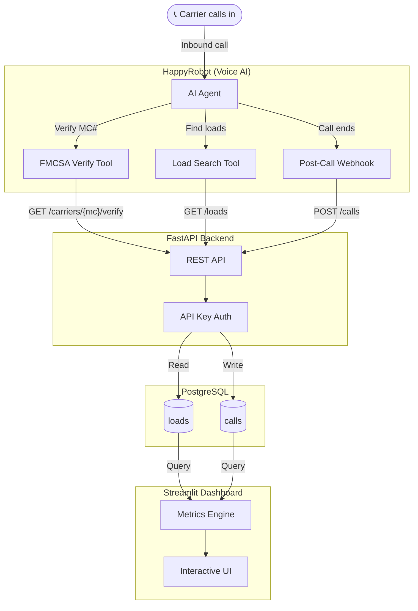

# Inbound Carrier Sales

AI-powered system using [HappyRobot](https://www.happyrobot.ai/) voice AI to handle carrier calls, verify authorities, match loads, negotiate rates, and log structured call records — backed by a FastAPI service and a Streamlit analytics dashboard.

## Project Structure

```text
api/           API (FastAPI)
dashboard/     Reporting dashboard (Streamlit)
data/          Seed CSV files
scripts/       CSV import scripts
schema.sql     PostgreSQL schema
```

## How It Works

1. A carrier calls the HappyRobot phone number.
2. The AI agent verifies the carrier's MC number against FMCSA via the backend API.
3. The agent asks for lane preferences and searches available loads.
4. If a match is found, the agent negotiates a rate (up to 3 turns).
5. When the call ends, a post-call webhook saves the structured call record to the database.
6. The Streamlit dashboard provides real-time analytics on call performance and outcomes.

## Architecture



### API Endpoints

| Method | Path | Auth | Description |
|--------|------|------|-------------|
| GET | `/health` | No | Health check |
| GET | `/loads` | API key | List loads (supports query filters) |
| GET | `/calls` | API key | List all calls |
| POST | `/calls` | API key | Record a call |
| GET | `/carriers/{mc_number}/verify` | API key | Verify carrier authority via FMCSA |

Pass `X-Api-Key` header for protected endpoints.

### Dashboard Metrics

- **Core Funnel** — Total calls → Authorized → Load matched → Booked
- **Negotiation** — Success rate, average turns, agreed rate vs. loadboard
- **Sentiment** — Distribution and breakdown by outcome
- **Facility Usage** — Origin/destination volumes and transfer rates
- **Operational** — Calls per hour, average duration by outcome

## Setup

### Native

#### Environment

```bash
python3 -m venv .venv
source .venv/bin/activate
pip install -r requirements.txt
cp .env.template .env
```

Edit `.env` with your PostgreSQL connection string.

#### API Key

Generate a key:

```bash
python -c "import secrets; print(secrets.token_urlsafe(32))"
```

Add it to `.env`:

```text
API_KEY=your_generated_key_here
```

Leave `API_KEY` empty to disable authentication during local development.

#### FMCSA Key

Register at [mobile.fmcsa.dot.gov](https://mobile.fmcsa.dot.gov/QCDevsite/home) and add to `.env`:

```text
FMCSA_WEB_KEY=your_fmcsa_key_here
```

#### Database

```bash
createdb inbound_carrier_sales
psql -d inbound_carrier_sales -f schema.sql
python scripts/import_loads.py
python scripts/import_calls.py
```

Loads must be imported before calls (foreign key dependency).

#### API Server

```bash
uvicorn api.main:app --reload
```

Docs at `http://127.0.0.1:8000/docs`.

#### Dashboard

```bash
python -m streamlit run dashboard/app.py
```

Opens at `http://localhost:8501`.

### Container

#### Start services

```bash
docker compose up --build -d
```

#### Seed data

```bash
docker compose run --rm seed
```

#### Environment

Docker Compose reads from `.env` in the project root via `env_file`. Set all variables there (same as native setup). The `DATABASE_URL` is overridden inside the container to point at the Compose database service.

#### Services

| Service | URL |
|---------|-----|
| API | http://localhost:8000 |
| Dashboard | http://localhost:8501 |

## Notes

- Import scripts shift timestamps using configurable anchor offsets to keep demo data current.
- Run Streamlit with `python -m streamlit` to avoid import path issues.
- A `render.yaml` blueprint is included for one-click deployment to [Render](https://render.com).
- [MIT license](LICENSE).
- Integrates with [HappyRobot](https://www.happyrobot.ai/), a proprietary AI platform. Use of HappyRobot is subject to their own terms of service and is not covered by this project's MIT license.